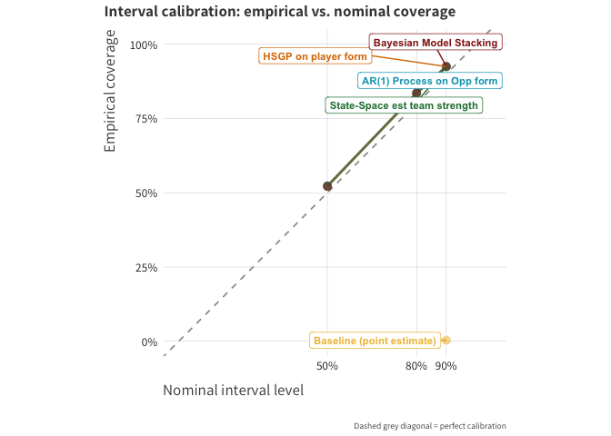

# A Fantasy Football Points Projector

Throughout the last four years of playing fantasy football, I have found
myself wanting a bit more from the predictions that my platform produces
every week. Part of it is that it only produces a single point estimate
and some, what I presume, MCMC simulations of the floor, ceiling, and
mean outcome. Personally, I would like to see all this as I agonize over
whether I should start or sit a player. So I decided to build a fully
Bayesian pipeline for forecasting and making roster decisions using a
similar setup to [this PyMC Labs blog
post](https://www.pymc-labs.com/blog-posts/probabilistic-forecasting-optimization-under-uncertainty)

## Setup

Dependencies are managed with
[`uv`](https://docs.astral.sh/uv/pip/packages/#installing-a-package). To
run this project, you need Python 3.14 installed. To replicate this
project, just run

    uv sync

## Project Structure

    fantasy-predictor/
    ├── src/                          # data pipeline, model definitions, backtesting
    │   ├── data-cleaning.py
    │   ├── ff-ar.py                  # ar_mod / hs_version / team_mod
    │   ├── ff-mlm.py
    │   ├── bart-mod.py
    │   ├── estimate-latent-ability.py
    │   ├── decision_engine.py
    │   ├── league_validate.py
    │   ├── calibrate_decisions.py
    │   ├── forecast_roster.py
    │   ├── mock_league.py
    │   ├── adp_league.py
    │   ├── backtest_harness.py       # walk-forward CRPS/RMSE/coverage backtest
    │   ├── summarize_backtest.py
    │   ├── sweep_summarize.py
    │   └── run_*.sh                  # backtest / calibration / sweep drivers
    ├── scripts/
    │   └── show_decision.py          # prints/writes the decision engine's actual lineup picks
    ├── eval_scripts/
    │   └── eval_utils.py
    ├── processed-data/
    │   ├── ff-processed.parquet
    │   └── team_form.parquet
    ├── results/
    │   ├── backtest_walkforward.csv
    │   ├── decision_example.csv
    │   └── league_validation.csv
    ├── README_files/
    │   └── figure-commonmark/        # plot images rendered into README.md
    ├── README.qmd
    ├── README.md
    ├── pyproject.toml
    ├── uv.lock
    ├── skills-lock.json
    └── .gitignore

## Data

All data are derived from
[`nflreadr`](https://nflreadr.nflverse.com/articles/index.html). To
train this model, I use data from 2013, when snaps are recorded, to
2025.

- Fantasy Football Opportunity: A precomputed expected fantasy points
  dataset. I use:
  - Total Fantasy Points: outcome variable of interest
  - Pass attempts, rush Attempts, receptions, and yardage to compute
    efficiency and usage statistics
  - Fantasy points allowed: A rolling average of fantasy points over
    expectation allowed by the opponent to a position group
- Schedules: a dataset containing schedule information. I use:
  - Spread line: The spread line for the game
  - Surface: collapsed to a binary variable where 1 indicates that the
    game is being played on grass
  - Roof: collapsed to a binary variable where 1 indicates whether the
    game was played indoors
  - Temperature: Temperature at the stadium
  - Wind: Speed of the wind in miles per hour.
  - Division Game: a binary variable where 1 indicates whether the game
    is against a divisional opponent
  - Home team: collapsed to a binary variable where 1 indicates that the
    player is on the home team.
  - Era: a binary indicator where 1 indicates the game occurs after the
    2018 rule change
- Snap counts: a dataset containing snap counts for each player:
  - Offensive percent: percent of snaps taken on offense
  - Special teams percent: percent of special teams snaps taken.
- Roster: a dataset containing information on every NFL roster. I use:
  - Rookie Year and Season to construct a player tenure variable.
- Fantasy Football Player IDs I use:
  - Pro Football Reference ID: merge key used to join snaps to main
    dataset

## Model Architecture

3 candidate models were eventually settled on using expected log
pointwise predictive density (ELPD) against a lot of candidate models.
Each of the three models shares some common components. Each of them
have the same priors on continuous and binary covariates. Each model is
a two-component mixture where a player’s recent games-missed and lagged
offensive snap share determine the mixtures weight between a “limited
role” and a “full-time role.” In the spirit of building a full fantasy
prediction machine I didn’t want to drop any players conditional on
offensive participation.

To get into the differences

**ar_mod**: This was effectively the baseline model. I use flat position
intercepts, a Gaussian random-walk over the number of years a player has
played in the NFL to measure latent skill and age curves, and a player
season intercept to capture deviations in player form in that particular
season. The AR structure draws heavily on Dave Zach’s [implementation in
his spread
model](https://github.com/dave-zack3/nfl_bayesian_rate_model/tree/main/src/models/spread).
I place this AR process on opponent-defense strength over the defense’s
week-to-week form.

**hs_version**: This model has two main structural swaps. I build a
varying effects model where each position gets its own position and its
own slope based on standardized tenure. This *tries*, to capture the
differing maturation curves of positional groups. In the past 5 years we
consistently see Wide Receivers break out in their rookie year while
Tight Ends tend to break out in their second or third year. The player
season intercept is then replaced with a Hilbert-space Gaussian Process
over a player’s season to capture week-to-week booms or ramp up to
injury.

**team_mod**: This model differs by omitting the player season
intercepts. I also modeled the latent ability of the player’s team and
the opponent via a state-space model on rest-adjusted score margins

## Results

After running the ELPD comparisons, the results suggested that I should
also try [model
stacking](https://www.pymc.io/projects/examples/en/latest/diagnostics_and_criticism/model_averaging.html#stacking).
I then ran a backtest on data from week 6 to week 15 for the 2013, 2019,
2023, and 2024 seasons. Looking at the RMSE, we see a modest improvement
over just using a player’s past mean.

|  | Mean RMSE | Mean MAE | Mean CRPS | Average Fit Time | RMSE % Improvement vs Baseline |
|----|----|----|----|----|----|
| State-Space Model estimated team strength | 6.389 | 4.747 | 3.353 | 3.122 | 5.36 |
| Bayesian Model Stacking | 6.392 | 4.748 | 3.350 | 8.908 | 5.32 |
| AR(1) Process on Opp form | 6.404 | 4.752 | 3.357 | 2.603 | 5.14 |
| HSGP on player form | 6.415 | 4.764 | 3.364 | 3.526 | 4.97 |

However, part of the underlying motivation of this project was to build
a decision engine where I can mitigate risky start-sit decisions. A
chance-constrained call that rests on a player clearing a certain
threshold x% of the time is meaningless if these intervals are not well
calibrated. Each of these models clears this hurdle by about 2
percentage points across each specification. For example, if we set the
threshold for making decisions at 50% and used the state-space model,
the bands that this model can produce hold the true value about 52% of
the time.



So how do we use this thing? Let’s take the Yahoo Fantasy Expert’s draft
from 2025 as an imperfect example. We can’t observe the week-to-week
add-drops or waiver-wire activity, so we can’t account for somebody
adding Daniel Jones in the first week or two of the season or dropping
Mike Evans when it was clear that his hamstring injury would prevent him
from playing the rest of the year. I built a small simulator where we
can build a round-robin schedule and have the lineups face each other.
For demonstration purposes, I ran the decision engine on weeks 2-4 since
we don’t have to worry about bye weeks. I will focus on team 5 in week 2
because this is the first week where the decision engine had a different
lineup than maximizing expected points.

Normally what I would do is just look at the players with the highest
projected point totals and then maybe adjust who is starting versus who
is sitting based on heuristics about matchup and potential game
conditions. So my lineup would look, mostly like the table below

| player           | predicted_pts | realized_pts | won  |
|------------------|---------------|--------------|------|
| Russell Wilson   | 14.47         | 30.3         | TRUE |
| Tyrone Tracy Jr. | 11.58         | 9.1          | TRUE |
| Alvin Kamara     | 14.03         | 16.0         | TRUE |
| Malik Nabers     | 13.92         | 37.7         | TRUE |
| Terry McLaurin   | 9.91          | 9.8          | TRUE |
| Trey McBride     | 14.15         | 13.8         | TRUE |
| James Cook       | 12.36         | 26.5         | TRUE |

However, this is just one rule. The decision engine has a few more.
Conditional Value at Risk (CVaR) trades some expected points for a more
stable floor. First we pick a target, a fixed point threshold, which in
this example is our opponent’s projected total for the week, and an
alpha, the fraction of worst-case scenarios we care about (20% here). To
see what this is actually doing, I worked through a small example: ten
representative weekly outcomes for a steady-floor player and a boom/bust
player. For every scenario, we compute the shortfall below target, then
average the shortfalls in just the worst 20% of scenarios. That average
is the CVaR. The decision rule then maximizes expected points minus a
penalty term, lambda, times that CVaR. Lambda controls how much of the
tradeoff to make. At lambda=0, this is identical to just starting the
highest-expected-points player. As lambda grows, the rule increasingly
favors the player whose bad weeks are smaller in magnitude, even at the
cost of a lower mean. In a practical sense, all we are doing is setting
how much average performance am I willing to give up to make sure the
floor doesn’t collapse.

``` r
draws = tibble(
  player = rep(c("Player A (boom/bust)", "Player B (steady floor)"), each = 10),
  total  = c(2, 4, 6, 8, 10, 12, 22, 28, 32, 36,      # A
            10, 11, 12, 13, 14, 15, 16, 17, 18, 19)  # B
)

target = 12
alpha  = 0.20   # worst 20% of scenarios

cvar_tbl = draws |>
  mutate(shortfall = pmax(target - total, 0)) |>
  group_by(player) |>
  summarise(
    expected = mean(total),
    cvar     = shortfall |> sort(decreasing = TRUE) |> head(ceiling(n() * alpha)) |> mean()
  )


lambdas = seq(0, 1, by = 0.1)

objective_curve = cvar_tbl |>
  crossing(lambda = lambdas) |>
  mutate(objective = expected - lambda * cvar) |>
  select(player, lambda, objective) 
```

So our CVaR framework decided on this lineup. The main difference is
that, due to the CVaR scoring, we ended up starting Joe Burrow over
Russell Wilson, even though the model’s own projections had Wilson
slightly ahead (14.5 vs. 13.4 expected points). That week, Wilson went
for 30.3 real points against Burrow’s 7.0, a 23.3-point swing we gave up
in exchange for a lower downside tail at QB. As it happened, the team
won the matchup either way, so this particular week is a clean example
of what the CVaR premium actually costs: real points given up for
protection the lineup didn’t end up needing. Meanwhile at RB, the same
logic worked in the more typical direction, starting Tony Pollard over
Tyrone Tracy, who has a higher ceiling but whose worst 20% of scenarios
are meaningfully worse than Pollard’s.

``` r
example_decisions |>  
    filter(week == 2,, lineup_type == 'rule') |>  
    filter(player %in% c('Joe Burrow', 'Tony Pollard')) |> 
    select(player, predicted_pts, realized_pts, won) |>
    relocate(player, .before = predicted_pts) |> 
    mutate(across(ends_with('pts'), \(x) round(x,2))) |> 
    tt()
```

| player       | predicted_pts | realized_pts | won  |
|--------------|---------------|--------------|------|
| Joe Burrow   | 13.37         | 7.04         | TRUE |
| Tony Pollard | 11.27         | 9.20         | TRUE |

## To Do

- \[\] Build a more robust decision engine to add in Pareto Analysis
  similar to [the PyMC blog
  post](https://www.pymc-labs.com/blog-posts/probabilistic-forecasting-optimization-under-uncertainty)
- \[\] Improve the organization of the repo so that we can use various
  scripts as modules and rewire the underlying scripts.
- \[\] Build a friendlier interface to use.
- \[\] Add a scheduler so I don’t have to run this manually everyweek
