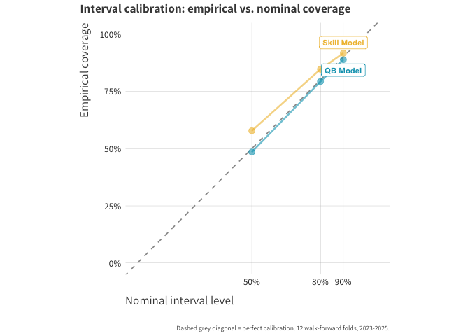

# A Fantasy Football Points Projector

Who should I start this week in fantasy football? Fantasy football is a
multi-billion-dollar industry with almost every major publication
leading their weekend coverage with “Start Sit Advice for week X.” In
the platform you use there is a proprietary model that outputs a single
forecast for the upcoming week. However, we all intuitively understand
that Football has a lot of uncertainty. Take week 2 of last years NFL
season if you had both Joe Burrow and Russell Wilson you may have
debated about who to start. Joe Burrow has a much higher floor and boom
potential, but Russell Wilson was playing against, what we would come to
know, as one of the worst defenses in by DVOA in quite awhile. While
less likely Wilson had a variety of scenarios where he could put up a
vintage Russell Wilson performance. Projections heading into the game
were fairly similar. Wilson was slightly ahead (14.5 vs. 13.4 expected
points). That week, Wilson went for 30.3 real points against Burrow’s
7.0, a 23.3-point swing.

So who should have this person started going into the game? Since we
were little we were probably told to think through the worst case
outcomes before making a decision. Instead of using rules of thumb or
preconceptions about players or matchups heading into the game, what if
we could incorporate the uncertainty in our forecasts and a set of the
worst case decisions to make more informed roster decisions?

Throughout the last four years of playing fantasy football, I have found
myself wanting a bit more from the predictions that my platform produces
every week. Part of it is that it only produces a single point estimate
and some, what I presume, MCMC simulations of the floor, ceiling, and
mean outcome. Personally, I would like to see all this as I agonize over
whether I should start or sit a player. So I decided to build a fully
Bayesian pipeline for forecasting and making roster decisions using a
similar setup to [this PyMC Labs blog
post](https://www.pymc-labs.com/blog-posts/probabilistic-forecasting-optimization-under-uncertainty).
The approach only works if the predictive intervals are honest, so most
of the effort below goes into checking that they are.



Across 12 walk-forward folds (weeks 4, 8, 12 and 16 of 2023-2025), the
50/80/90% intervals hold the real score 58/85/92% of the time for
RB/WR/TE and 49/79/89% for QB. That is close enough to trust a
chance-constrained call, with one known problem covered in
[Results](#results): for low projections the intervals are too wide.

## Setup

Dependencies are managed with
[`uv`](https://docs.astral.sh/uv/pip/packages/#installing-a-package). To
run this project, you need Python 3.14 installed. To replicate this
project, just run

    uv sync

## Weekly use

Everything runs through one command-line entry point, from the project
root:

``` bash
# 1. refresh the data through last week (needs network)
uv run python src/ff.py build-data
# 2. refresh team form
uv run python src/ff.py build-team-form
# 3. fit both models and forecast the coming week -> forecasts/2026_wk05/
uv run python src/ff.py forecast 2026 5
# 4. choose a lineup
uv run python src/ff.py decide forecasts/2026_wk05 --roster my_roster.txt --rule maximize_expected
uv run python src/ff.py decide forecasts/2026_wk05 --roster my_roster.txt --rule cvar_averse --lam 2
uv run python src/ff.py decide forecasts/2026_wk05 --roster my_roster.txt --rule head_to_head --opponent their_roster.csv
```

`decide` also reports the runner-up lineup and flags a **near tie** when
the gap between them is within simulation noise, so a coin-flip
start/sit call doesn’t look like a confident one. `src/README.md` has
the details: every command, the backtest and league-simulation tools,
and what changed from the research code.

## Testing

    uv run pytest src/tests -q

The fast tests build everything against a small synthetic league; tests
that need the real parquet files skip themselves if the files are
missing. Slow model fits are opt-in:

    RUN_SLOW_TESTS=1 uv run pytest src/tests -q

## Project Structure

    fantasy-predictor/
    ├── src/
    │   ├── ff.py                     # command-line entry point
    │   ├── ffpred/
    │   │   ├── config.py             # paths, roster shape, model configs, sampler settings
    │   │   ├── data_build.py         # nflverse -> processed-data/ff-processed.parquet
    │   │   ├── team_form.py          # off/def team-strength state-space model -> team_form.parquet
    │   │   ├── data.py               # loading, Vegas features, as-of team-form join, training windows
    │   │   ├── upcoming.py           # model rows for a week that hasn't been played yet
    │   │   ├── model.py              # the het_gp models: build, fit, predict, diagnostics
    │   │   ├── forecast.py           # both models -> one week's joint predictive draws
    │   │   ├── decision_engine.py    # lineup rules
    │   │   ├── backtest.py           # walk-forward folds, one JSON per fold
    │   │   ├── league.py             # league simulation of the decision rules
    │   │   └── scoring.py            # CRPS / RMSE / coverage / tail calibration
    │   ├── scratch.py                # model experiments
    │   └── tests/
    ├── processed-data/
    │   ├── ff-processed.parquet
    │   └── team_form.parquet
    ├── results/
    │   └── backtest/calib/           # the walk-forward folds behind the plots above
    ├── README.qmd
    ├── README.md
    ├── pyproject.toml
    └── uv.lock

The research code that got the project here (the earlier model families,
ablations and the original backtest harness) is in the git history; see
[How the model evolved](#how-the-model-evolved).

## Data

All data are derived from
[`nflreadr`](https://nflreadr.nflverse.com/articles/index.html). To
train this model, I use data from 2013, when snaps are recorded, to
2025.

- Fantasy Football Opportunity: A precomputed expected fantasy points
  dataset. I use:

  - Total Fantasy Points: outcome variable of interest
  - Pass attempts, rush attempts, receptions, and yardage to compute
    efficiency and usage statistics
  - Fantasy points allowed: A rolling average of fantasy points over
    expectation allowed by the opponent to a position group

- Schedules: a dataset containing schedule information. I use:

  - Spread line: The spread line for the game.
  - Implied team total
  - Surface: collapsed to a binary variable where 1 indicates that the
    game is being played on grass
  - Roof: collapsed to a binary variable where 1 indicates whether the
    game was played indoors
  - Temperature: Temperature at the stadium
  - Wind: Speed of the wind in miles per hour.
  - Division Game: a binary variable where 1 indicates whether the game
    is against a divisional opponent
  - Home team: collapsed to a binary variable where 1 indicates that the
    player is on the home team.
  - Era: a binary indicator where 1 indicates the game occurs after the
    2018 rule change

- Snap counts: a dataset containing snap counts for each player:

  - Offensive percent: percent of snaps taken on offense
  - Special teams percent: percent of special teams snaps taken.

- Roster: a dataset containing information on every NFL roster. I use:

  - Rookie Year and Season to construct a player tenure variable.

- Vegas lines (from the schedules): converted to the player’s side of
  the game.

  - Team spread: the spread from the player’s team’s point of view
    (positive = favoured)
  - Implied team total: half the game total plus half the team spread,
    i.e. how many points Vegas expects the player’s team to score

- Team form: a dynamic offense/defense team-strength model (a
  state-space model on score margins, filtered with a Kalman filter)
  gives each team’s form going into the week. Only weeks strictly before
  the game are used.

- Fantasy Football Player IDs I use:

  - Pro Football Reference ID: merge key used to join snaps to main
    dataset

## Model Architecture

There are two models with the same structure: one for RB/WR/TE and a
separate one for QBs, whose scoring and aging look quite different.
Points are standardized within the training window, and each player’s
expected score for a week is built from:

- **A position intercept.**
- **A career aging curve.** A smooth bump over a player’s tenure, with a
  shared width and a peak timing and height that vary by position: wide
  receivers can break out as rookies while tight ends tend to peak
  later. The QB model uses age instead of tenure and lets the curve rise
  and fall at different rates.
- **Player skill.** A career-long level for each player, partially
  pooled within his position.
- **Player form.** A Gaussian process over each player’s seasons
  (Matérn-3/2 over tenure), so a player can be better or worse than his
  career level in a given year without that leaking into other years.
- **Game context.** Standardized usage and efficiency lags (target
  share, rush share, snap shares, yards per target, depth of target, …),
  the opponent’s recent points allowed to the position, weather, the
  player’s side of the Vegas line and implied team total, binary game
  conditions, and both teams’ form going into the week.

For RB/WR/TE the noise is heteroskedastic: each position has its own
baseline spread, and a second Gaussian process lets the spread change
over a career. The QB model uses a single noise scale.

Fits use NUTS (via nutpie) with 4 chains of 1,000 draws after 1,000
tuning steps. The skill-position model takes about 3 minutes per fold
and the QB model under a minute.

### How the model evolved

The first three candidates were chosen by expected log pointwise
predictive density (ELPD) from a larger set. Each was a two-component
mixture in which recent games missed and lagged snap share set the
weight between a “limited role” and a “full-time role”, so no player had
to be dropped for low participation.

**ar_mod** was the baseline: flat position intercepts, a Gaussian random
walk over tenure for latent skill and aging, and a player-season
intercept for in-season form. The AR structure draws heavily on Dave
Zach’s [implementation in his spread
model](https://github.com/dave-zack3/nfl_bayesian_rate_model/tree/main/src/models/spread),
applied to opponent-defense strength.

**hs_version** gave each position its own intercept and tenure slope,
and replaced the player-season intercept with a Hilbert-space Gaussian
process over a player’s season.

**team_mod** dropped the player-season intercepts and added the latent
strength of both teams through a state-space model on rest-adjusted
score margins, inspired by [Chris Fonnesbeck’s World Cup
model](https://www.pymc-labs.com/blog-posts/forecasting-the-2026-world-cup-group-stage).

Stacking, R2D2 shrinkage priors and BART were also tried. The current
models came out of those experiments: the aging curve and per-player
season GP replaced the random walk and season intercepts. Two ablations
settled the inputs: the player’s side of the Vegas line and the implied
team total beat the raw home-perspective spread, and richer team-model
context added nothing once they were in; advanced NGS/QBR stats added
nothing out of sample once a data leak in how they were joined was
removed.

## Results

Each fold fits on the three seasons before the target week and forecasts
that week’s players; the baseline is each player’s past average.

|  | RMSE | Baseline | RMSE % improvement vs baseline | CRPS | Avg fit time (min) |
|----|----|----|----|----|----|
| QB Model | 7.57 | 8.11 | 6.70 | 4.28 | 0.39 |
| Skill Model | 6.02 | 6.33 | 4.86 | 3.25 | 2.82 |

The models beat the past-average baseline by 4.86 for skill positions
and 6.7 for QBs. That is a modest gain in point accuracy, but the
decision engine needs more than an accurate mean: a chance-constrained
call that rests on a player clearing a threshold x% of the time is
meaningless if the intervals are not calibrated. Overall coverage, in
the plot at the top, is close to nominal. Broken down by how many points
a player is projected for, it is less even:

    # A tibble: 179 × 12
       model    season  week pos   tier      n mean_expected mean_actual below_p10
       <chr>     <int> <int> <chr> <fct> <int>         <dbl>       <dbl>     <dbl>
     1 QB Model   2023     4 QB    6-12      9          9.47        4.36    0.222 
     2 QB Model   2023     4 QB    12-18    22         15.3        13.7     0.136 
     3 QB Model   2023     4 QB    18+       7         19.4        21.2     0.143 
     4 QB Model   2023     8 QB    <6        3          4.97        1.85    0     
     5 QB Model   2023     8 QB    6-12      6         10.1        10.7     0.167 
     6 QB Model   2023     8 QB    12-18    21         15.3        15.6     0.0952
     7 QB Model   2023     8 QB    18+       6         21.0        21.3     0.167 
     8 QB Model   2023    12 QB    <6        5          3.72        0.82    0     
     9 QB Model   2023    12 QB    6-12      8         10.0        11.0     0     
    10 QB Model   2023    12 QB    12-18    16         15.5        14.4     0.125 
    # ℹ 169 more rows
    # ℹ 3 more variables: above_p90 <dbl>, pred_sd <dbl>, resid_sd <dbl>

| Model | Projection tier | Players | Mean projected | Mean actual | % below p10 | % above p90 | Predicted sd | Actual sd of misses |
|----|----|----|----|----|----|----|----|----|
| Skill position | \<6 | 1161 | 3.9 | 3.8 | 0.0 | 5.7 | 6.0 | 3.9 |
| Skill position | 6-12 | 1276 | 8.7 | 8.6 | 4.5 | 12.1 | 6.1 | 6.0 |
| Skill position | 12-18 | 553 | 14.2 | 14.7 | 13.0 | 17.7 | 6.3 | 7.7 |
| Skill position | 18+ | 61 | 19.7 | 21.0 | 18.0 | 14.8 | 6.4 | 6.6 |
| QB Model | \<6 | 49 | 3.8 | 4.9 | 0.0 | 10.2 | 7.6 | 4.6 |
| QB Model | 6-12 | 76 | 9.4 | 8.5 | 7.9 | 5.3 | 7.6 | 6.0 |
| QB Model | 12-18 | 235 | 15.3 | 16.0 | 8.5 | 12.8 | 7.4 | 7.3 |
| QB Model | 18+ | 79 | 20.1 | 19.4 | 17.7 | 15.2 | 7.4 | 8.2 |

A calibrated model would put 10% of outcomes below the 10th percentile
and 10% above the 90th in every tier, with the predicted and actual
spread matching. Instead the model gives every player roughly the same
spread (about 6 points for skill positions), while real spread grows
with the projection: about 4 points for players projected under 6, about
8 for players projected 12-18. So the floor for low-projection players
is too pessimistic (no outcomes fell below the 10th percentile), and the
range for high-projection players is too narrow. Letting the spread
scale with the projection is the main thing in progress; see the to-do
list.

So how do we use this thing? (The example below was produced with an
earlier version of the models; the decision rules work the same way.)
Let’s take the Yahoo Fantasy Expert’s draft from 2025 as an imperfect
example. We can’t observe the week-to-week add-drops or waiver-wire
activity, so we can’t account for somebody adding Daniel Jones in the
first week or two of the season or dropping Mike Evans when it was clear
that his hamstring injury would prevent him from playing the rest of the
year. I built a small simulator where we can build a round-robin
schedule and have the lineups face each other. For demonstration
purposes, I ran the decision engine on weeks 2-4 since we don’t have to
worry about bye weeks. I will focus on team 5 in week 2 because this is
the first week where the decision engine had a different lineup than
maximizing expected points.

Normally what I would do is just look at the players with the highest
projected point totals and then maybe adjust who is starting versus who
is sitting based on heuristics about matchup and potential game
conditions. So my lineup would look, mostly like the table below

| player           | predicted_pts | realized_pts | won  |
|------------------|---------------|--------------|------|
| Russell Wilson   | 14.47         | 30.3         | TRUE |
| Tyrone Tracy Jr. | 11.58         | 9.1          | TRUE |
| Alvin Kamara     | 14.03         | 16.0         | TRUE |
| Malik Nabers     | 13.92         | 37.7         | TRUE |
| Terry McLaurin   | 9.91          | 9.8          | TRUE |
| Trey McBride     | 14.15         | 13.8         | TRUE |
| James Cook       | 12.36         | 26.5         | TRUE |

However, this is just one rule. The decision engine has a few more.
Conditional Value at Risk (CVaR) trades some expected points for a more
stable floor. First we pick a target, a fixed point threshold, which in
this example is our opponent’s projected total for the week, and an
alpha, the fraction of worst-case scenarios we care about (20% here). To
see what this is actually doing, I worked through a small example: ten
representative weekly outcomes for a steady-floor player and a boom/bust
player. For every scenario, we compute the shortfall below target, then
average the shortfalls in just the worst 20% of scenarios. That average
is the CVaR. The decision rule then maximizes expected points minus a
penalty term, lambda, times that CVaR. Lambda controls how much of the
tradeoff to make. At lambda=0, this is identical to just starting the
highest-expected-points player. As lambda grows, the rule increasingly
favors the player whose bad weeks are smaller in magnitude, even at the
cost of a lower mean. In a practical sense, all we are doing is setting
how much average performance am I willing to give up to make sure the
floor doesn’t collapse.

``` r
draws = tibble(
  player = rep(c("Player A (boom/bust)", "Player B (steady floor)"), each = 10),
  total  = c(2, 4, 6, 8, 10, 12, 22, 28, 32, 36,      # A
            10, 11, 12, 13, 14, 15, 16, 17, 18, 19)  # B
)

target = 12
alpha  = 0.20   # worst 20% of scenarios

cvar_tbl = draws |>
  mutate(shortfall = pmax(target - total, 0)) |>
  group_by(player) |>
  summarise(
    expected = mean(total),
    cvar     = shortfall |> sort(decreasing = TRUE) |> head(ceiling(n() * alpha)) |> mean()
  )


lambdas = seq(0, 1, by = 0.1)

objective_curve = cvar_tbl |>
  crossing(lambda = lambdas) |>
  mutate(objective = expected - lambda * cvar) |>
  select(player, lambda, objective) 
```

So our CVaR framework decided on this lineup. The main difference is
that, due to the CVaR scoring, we ended up starting Joe Burrow over
Russell Wilson, even though the model’s own projections had Wilson
slightly ahead (14.5 vs. 13.4 expected points). That week, Wilson went
for 30.3 real points against Burrow’s 7.0, a 23.3-point swing we gave up
in exchange for a lower downside tail at QB. As it happened, the team
won the matchup either way, so this particular week is a clean example
of what the CVaR premium actually costs: real points given up for
protection the lineup didn’t end up needing. Meanwhile at RB, the same
logic worked in the more typical direction, starting Tony Pollard over
Tyrone Tracy, who has a higher ceiling but whose worst 20% of scenarios
are meaningfully worse than Pollard’s.

| player       | predicted_pts | realized_pts | won  |
|--------------|---------------|--------------|------|
| Joe Burrow   | 13.37         | 7.04         | TRUE |
| Tony Pollard | 11.27         | 9.20         | TRUE |

## Decision Engine

The decision engine takes the joint predictive draws for a roster and
picks a lineup under one of several rules:

- `maximize_expected`: the highest expected total. What
- `chance_constrained`: the best expected total among lineups that clear
  a points floor in at least a given share of simulated weeks.
- `cvar_averse`: expected points minus a penalty on the average
  shortfall in the worst weeks (the CVaR example above).
- `head_to_head`: the lineup most likely to beat a specific opponent’s
  lineup.
- `pareto_frontier`: the trade-off between expected points and downside
  risk, so you can see what each step of safety costs.

The structure (scenarios from the posterior predictive, then
optimization over them) follows the [PyMC Labs
post](https://www.pymc-labs.com/blog-posts/probabilistic-forecasting-optimization-under-uncertainty)
and FICO’s [stochastic energy-planning
example](https://github.com/fico-xpress/xpress-community/blob/main/StochasticEnergyPlanning/stochastic_energy_planning.py)
for Xpress. Small rosters are solved by enumerating every lineup;
mixed-integer versions are available when the Xpress solver is
installed.

## To Do

- [x] Build a more robust decision engine to add in Pareto Analysis
  similar to [the PyMC blog
  post](https://www.pymc-labs.com/blog-posts/probabilistic-forecasting-optimization-under-uncertainty)
- [x] Improve the organization of the repo so that we can use various
  scripts as modules and rewire the underlying scripts.
- [x] Report near ties so coin-flip start/sit calls are flagged as such.
- [ ] Let the predictive spread grow with the projection (fixes the tier
  calibration above). A first version improved CRPS by about 2% but
  pulled down projections for top players, because tying the spread to
  the mean biases the mean; the next version ties it to the player’s
  trailing average instead.
- [ ] Compare lineups chosen with and without that change by realized
  points, not just forecast scores.
- [ ] Try out [Alchemize](https://github.com/pymc-labs/alchemize) to
  rebuild the underlying models in Rust to speed up sampling.
- [ ] Build a friendlier interface to use.
- [ ] Add a scheduler so I don’t have to run this manually every week.
